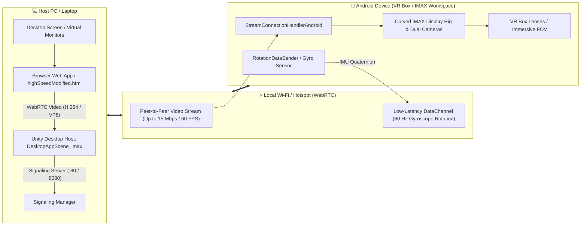

# 🌌 AR Metaverse

<div align="center">

[-black?style=for-the-badge&logo=unity)](https://unity.com/)
[](https://developers.google.com/ar)
[](https://webrtc.org/)
[](https://www.android.com/)
[](LICENSE)
[](https://github.com/Ahmev-Ayush/AR-Metaverse/pulls)

**Transform any budget Android smartphone & laptop into a high-performance, ultra-low latency Spatial Computing Workstation.**

[Explore Features](#-key-features) • [Architecture](#-system-architecture) • [Getting Started](#-quick-start-guide) • [Scene Directory](#-scenes--modes-directory) • [Roadmap](#-future-roadmap)

</div>

---

## 💡 The Vision

Premium spatial headsets like the **Apple Vision Pro** and **Meta Quest 3** unlock revolutionary multi-monitor computing experiences, but they cost anywhere from **$500 to $3,500+**.

**AR Metaverse** bridges the accessibility gap by democratizing spatial computing. By pairing the hardware you already own—a standard laptop, a regular Android smartphone, and a budget VR Box / Google Cardboard headset—it delivers an expansive, immersive, ultra-responsive virtual multi-monitor workspace floating right in your physical room at **zero hardware upgrade cost**.

---

## 🎬 Visual Demos

<div align="center">

### 👓 Handheld AR Spatial Anchor Workspace

*Real-world plane anchoring & desktop display mirroring on mobile AR.*

<br/>

### 🥽 Stereoscopic VR Box / Cardboard Workspace

*Low-latency remote rendering with 60Hz gyroscope head-tracking & IMAX field-of-view.*

> 💡 *If GIFs take time to load, view the high-definition video files in [`Demos/`](Demos/): [ARWorkspace.mp4](Demos/ARWorkspace.mp4) & [VRWorkspace.mp4](Demos/VRWorkspace.mp4).*

</div>

---

## ✨ Key Features

| Feature | Description |
| :--- | :--- |
| ⚡ **Zero-Latency WebRTC Pipeline** | Sub-30ms peer-to-peer desktop screen streaming via Unity Render Streaming with hardware-accelerated video codecs. |
| 🥽 **Stereoscopic 3D Dual-Camera Rig** | Custom split-screen renderer with runtime Interpupillary Distance (IPD ~64mm) adjustment tailored for VR Box & Google Cardboard. |
| 🔄 **Real-Time Gyro Head Tracking** | 60Hz smartphone IMU/gyroscope data streaming over WebRTC DataChannels with Quaternion Slerp smoothing for zero-jitter orientation. |
| 📈 **Adaptive Quality Manager** | Dynamic network evaluation scaling bitrate from **2 Mbps up to 15 Mbps @ 60 FPS** based on Wi-Fi conditions. |
| 🌐 **Smart Reconnection & Watchdog** | Automatic IP normalization (`ws://`, `http://`, raw IP), exponential backoff reconnection, and frozen-frame watchdog recovery. |
| 🖼️ **IMAX & Curved Spatial Displays** | Supports flat spatial quads as well as immersive curved IMAX displays for maximum readability and peripheral comfort. |
| 🔋 **Thermal & Battery Optimization** | Configurable target framerates, fixed DPI scaling, and lightweight tracking modes to prevent mobile thermal throttling. |

---

## 🏗️ System Architecture



---

## 📂 Project Structure

```text
AR-Metaverse/
├── Assets/
│   ├── Scenes/
│   │   ├── RemoteRenderingScenes/
│   │   │   ├── imax/                         # ⭐ Recommended IMAX Curved Spatial Scenes
│   │   │   │   ├── AndroidAppScene_imax.unity # Android IMAX VR client + Gyro sender
│   │   │   │   └── DesktopAppScene_imax.unity # Host PC IMAX renderer + remote camera
│   │   │   ├── AndroidAppScene 2.unity       # Flat quad Android VR client
│   │   │   └── DesktopAppScene 2.unity       # Flat quad Host PC receiver
│   │   ├── SplitScreenScene1.unity  # Stereoscopic rendering on Canvas Display
│   │   ├── SplitScreenScene2.unity  # Stereoscopic rendering for Google Cardboard
│   │   ├── ARMetaverseScene.unity   # AR Foundation plane-detection workspace
│   │   └── ARMetaverseSceneModified.unity # Rotation-only lightweight AR mode
│   ├── Scripts/                     # Core C# engine & networking scripts
│   │   ├── WebServerIPScript.cs            # URL normalization & auto-reconnect
│   │   ├── DynamicStreamQualityManager.cs  # Dynamic bitrate & FPS auto-scaler
│   │   ├── StreamConnectionHandlerAndroidScript.cs # Frame receiver & watchdog
│   │   ├── RotationDataSender.cs           # Android Gyroscope WebRTC sender
│   │   ├── RotationDataReceiver.cs         # Host PC Slerp smoothed receiver
│   │   ├── VRSplitScreenScript.cs          # Stereoscopic IPD camera controller
│   │   └── WebRTCOptimizerScript.cs        # Render Streaming performance tuner
│   └── Prefabs/                     # XR Origin, Quad Displays, UI Canvases
├── web app/
│   ├── highspeedScreenShare/
│   │   └── highSpeedModified.html   # ⭐ High-speed screen sharing dashboard with bitrate selector
│   ├── public1/
│   │   └── screenshare.html         # Screen capture UI
│   └── webserver.exe                # Lightweight standalone WebRTC signaling server
├── Builds/                          # Pre-built APKs for rapid testing
├── Demos/                           # High-res recordings & animated demo GIFs
├── DEVLOG.md                        # Complete chronological development history
└── IMPROVEMENTS_DOC.md              # Technical deep-dive & Unity Inspector guide
```

---

## 🎮 Scenes & Modes Directory

| Scene Name | Platform | Key Use Case |
| :--- | :--- | :--- |
| **`AndroidAppScene_imax`** ⭐ | Android | **Primary recommended VR Client:** Curved ultra-wide IMAX spatial workstation receiving desktop stream and broadcasting gyroscope orientation. |
| **`DesktopAppScene_imax`** ⭐ | Windows PC | **Primary recommended Host Renderer:** IMAX spatial camera host rendering screen to virtual curved display and rotating camera with head movement. |
| **`AndroidAppScene 2`** | Android | Flat quad VR Box client with gyroscope orientation sender. |
| **`DesktopAppScene 2`** | Windows PC | Flat quad Host PC receiver. |
| **`SplitScreenScene2`** | Android | Standalone Cardboard stereoscopic split-screen mode. |
| **`ARMetaverseSceneModified`**| Android | High-performance AR mode with plane detection disabled (reduces CPU usage & heat). |
| **`ARMetaverseScene`** | Android | Full ARCore plane detection & spatial anchor placement on real physical tables/walls. |

---

## 🚀 Quick Start Guide

### 📋 Prerequisites
1. **Host PC:** Windows 10/11 with Google Chrome or Microsoft Edge.
2. **Android Device:** Android 7.0+ (with Gyroscope sensor for VR Box / Cardboard head tracking).
3. **Unity Editor:** **Unity 6 (6000.4.0f1 or newer Unity 6 LTS)** with **Android Build Support** installed.
4. **Network:** Both devices connected to the same local Wi-Fi router or mobile hotspot.

---

### Step 1: Start the Signaling Server
Navigate to the `web app/` directory and start the signaling server:
```bash
cd "web app"
./webserver.exe
```
*Note your local IP address displayed in the terminal (e.g. `192.168.1.50:80`).*

---

### Step 2: Launch the Desktop Screen Sharer
1. Open your browser and navigate to:
   ```text
   http://localhost:80/highspeedScreenShare/highSpeedModified.html
   ```
2. Click **Start Screen Share** and select the screen or application window you wish to cast into spatial space.
3. Select your desired bitrate profile (**15 Mbps Ultra**, **10 Mbps High**, or **5 Mbps Balanced**).

---

### Step 3: Build & Deploy IMAX App to Android
1. Open the project in Unity Hub.
2. Go to **File > Build Settings** and switch the platform to **Android**.
3. Select `Assets/Scenes/RemoteRenderingScenes/imax/AndroidAppScene_imax.unity` (or install the pre-compiled APK from `Builds/`).
4. Click **Build and Run** to install the app on your smartphone.

---

### Step 4: Run the Host Desktop IMAX Scene & Connect
1. In the Unity Editor on your PC, open and press **Play** on `Assets/Scenes/RemoteRenderingScenes/imax/DesktopAppScene_imax.unity`.
2. On your Android smartphone:
   - Launch the **AR Metaverse** app (`AndroidAppScene_imax`).
   - Enter your PC's IP address (saved automatically for future sessions).
   - Tap **Connect** and place your phone into your VR Box / Google Cardboard headset.
3. Enjoy your ultra-wide curved IMAX 360° floating desktop workspace!

---

## ⚙️ Configuration & Inspector Reference

<details>
<summary><b>🔧 Click to expand Unity Inspector Setup Instructions</b></summary>

### 1. `WebServerIPScript.cs` (Connection Management)
- **Server Address Input Field:** Assign your UI `TMP_InputField`.
- **Connection Status Text:** Assign UI `TMP_Text` for live status indicators.
- **Auto Reconnect On Disconnect:** `True` (exponential retry interval).
- **Load Saved Url On Start:** `True` (`PlayerPrefs` persistent memory).

### 2. `DynamicStreamQualityManager.cs` (Bitrate Control)
- **Min Bitrate:** `2000 Kbps` (2 Mbps for congested networks).
- **Max Bitrate:** `15000 Kbps` (15 Mbps for crystal-clear code & text reading).
- **Evaluation Interval:** `3.0 seconds`.

### 3. `RotationDataReceiver.cs` (PC Host Head Tracking)
- **Connection ID:** `InputStream`.
- **Smooth Factor:** `20` (Quaternion Slerp interpolation for butter-smooth rotation).
- **Initial Rotation Offset:** `(90, 0, 0)` (adjust based on phone mounting orientation).

### 4. `VRSplitScreenScript.cs` (Stereoscopic Rig)
- **Left Eye Camera:** Tracked Main Camera.
- **Interpupillary Distance (IPD):** `0.064` (64mm human average).

</details>

---

## 🔮 Future Roadmap

- [ ] **Virtual Multi-Monitor Expansion:** Multi-track WebRTC pipeline allowing 3+ distinct virtual monitors arranged in a 180° spatial arc.
- [ ] **Smartphone as Laser Pointer / Virtual Trackpad:** Utilize the phone screen as a 3DoF spatial pointer and mouse trackpad when unmounted.
- [ ] **mDNS Zero-Config Discovery:** Automatic LAN UDP broadcast to auto-pair Android devices with the host PC without typing IP addresses.
- [ ] **Passthrough Blend Toggle:** One-tap toggle between VR dark theater mode and AR camera passthrough.
- [ ] **WebXR Integration:** Direct browser-based WebXR client compatibility.

---

## 🤝 Contributing

Contributions, feature suggestions, and bug reports are warmly welcome!
1. Fork the repository.
2. Create your feature branch (`git checkout -b feature/AmazingFeature`).
3. Commit your changes (`git commit -m 'Add some AmazingFeature'`).
4. Push to the branch (`git push origin feature/AmazingFeature`).
5. Open a **Pull Request**.

---

## 📜 License

This project is licensed under the **MIT License** - see the [LICENSE](LICENSE) file for details.

---

<div align="center">

Made with ❤️ by [Ayush](https://github.com/Ahmev-Ayush) & the Open Source Community.

⭐ **If you find this project exciting, give it a star!** ⭐

</div>
